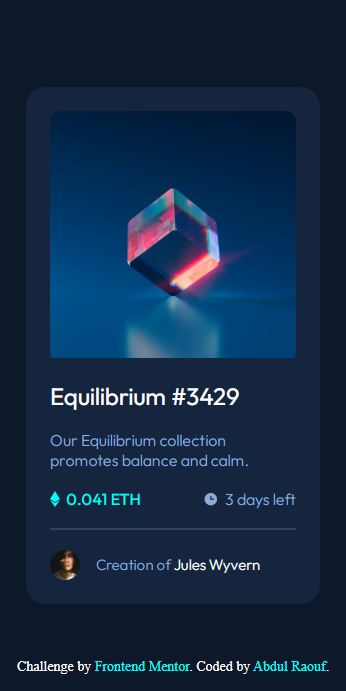
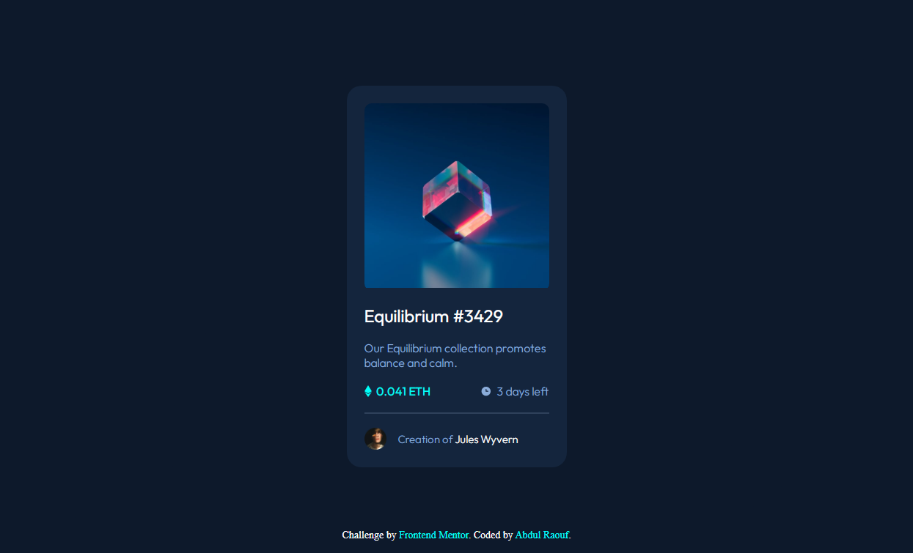
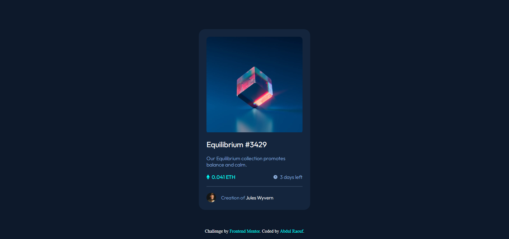

# Frontend Mentor - NFT preview card component solution

This is a solution to the [NFT preview card component challenge on Frontend Mentor](https://www.frontendmentor.io/challenges/nft-preview-card-component-SbdUL_w0U). Frontend Mentor challenges help you improve your coding skills by building realistic projects.

## Table of contents

- [Frontend Mentor - NFT preview card component solution](#frontend-mentor---nft-preview-card-component-solution)
  - [Table of contents](#table-of-contents)
  - [Overview](#overview)
    - [The challenge](#the-challenge)
    - [Screenshot](#screenshot)
    - [Links](#links)
  - [My process](#my-process)
- [Body Section](#body-section)
  - [Create a main section](#create-a-main-section)
    - [1. Image-Box](#1-image-box)
    - [2. h1](#2-h1)
    - [3. paragraph](#3-paragraph)
    - [4. time and price](#4-time-and-price)
    - [5. hr](#5-hr)
    - [6. div](#6-div)
    - [Built with](#built-with)
    - [What I learned](#what-i-learned)
  - [Author](#author)

## Overview

### The challenge

I was challanged to make a card which should have some hover effects

### Screenshot





### Links

- Solution URL: [Add solution URL here](https://your-solution-url.com)
- Live Site URL: [Add live site URL here](https://your-live-site-url.com)

## My process

# Body Section

Properties

```css
width: 100%;
min-height: 100vh;
display: flex;
justify-content: center;
align-items: center;
background: hsl(217, 54%, 11%);
```

## Create a main section

Properties

```css
background: hsl(216, 50%, 16%);
width: min(350px, 92%);
border-radius: 20px;
padding: 1rem;
display: flex;
flex-direction: column;
gap: 1rem;
```

### 1. Image-Box

```css
border-radius: 10px;
```

> Image

```css
width: 100%;
```

### 2. h1

### 3. paragraph

### 4. time and price

### 5. hr

### 6. div

- img
- span
- span name

### Built with

- Semantic HTML5 markup
- CSS custom properties
- Flexbox
- Mobile-first workflow

### What I learned

I learned a lot from here because the previous project was very helpful I made some mistakes and got solved by the help of community
like

- using semantic tags for accessibility
- using right width and height

```css
.proud-of-this-css {
  width: 100%;
}
```

instead of

```css
 {
  width: 100vw;
}
```

because it creates scrolling

## Author

- Frontend Mentor - [@AbdulRaouf33](https://www.frontendmentor.io/profile/Abdul-Raouf-33)
- Twitter - [@AbdulRaouf33](https://www.twitter.com/AbdulRaouf33)
